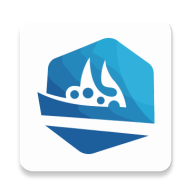

# 船舶中央控制系统 (CenterShipController)

  

## 项目概述

船舶中央控制系统是一款专为船舶远程控制设计的Android应用，提供了直观的用户界面和稳定的通信机制，实现对船舶设备的实时监控和精确控制。系统采用主从架构，通过WebSocket协议建立可靠的通信链路，支持摇杆控制、地图导航、设备状态监控等核心功能。

## 主要功能

### 1. 船舶远程控制
- **摇杆控制**：通过自定义摇杆界面实现对船舶推进系统的精确控制
- **实时反馈**：支持震动反馈，增强操作体验
- **高性能通信**：采用无锁设计的命令处理机制，确保控制指令的及时传输

### 2. 地图与定位
- **高德地图集成**：提供实时位置显示和导航功能
- **定位追踪**：支持船舶位置的实时追踪和记录
- **地图自定义**：优化的地图UI，提供更好的用户体验

### 3. 设备连接与管理
- **二维码扫描连接**：通过扫描二维码快速建立与船舶设备的连接
- **设备状态监控**：实时显示设备工作状态、电池电量等关键信息
- **多设备支持**：可同时连接和管理多个船舶设备

### 4. 系统功能
- **权限管理**：智能处理Android权限请求，确保应用正常运行
- **用户设置**：提供个性化设置选项，满足不同用户需求
- **沉浸式体验**：优化的UI设计，提供全屏沉浸式操作体验

## 技术架构

### 核心组件

- **MainActivity**：应用主界面，负责集成地图、摇杆控制和设备状态显示
- **MainDeviceSocket**：WebSocket通信管理，处理与船舶设备的实时数据交换
- **JoySticksDecoder**：摇杆输入解码器，将用户输入转换为船舶控制命令
- **DeviceInfoCard**：设备信息显示组件，提供设备状态的可视化展示
- **QR_codeScannerActivity**：二维码扫描界面，用于快速连接设备

### 技术特点

- **高性能设计**：采用无锁队列和线程池优化性能，确保控制指令的实时性
- **稳定通信**：实现WebSocket心跳机制，保持连接稳定性
- **模块化架构**：清晰的代码组织和模块划分，便于维护和扩展
- **响应式UI**：采用现代Android UI设计，支持不同屏幕尺寸和方向

## 安装要求

- Android 6.0 (API 23) 或更高版本
- 支持高德地图SDK的设备
- 摄像头（用于二维码扫描）
- 网络连接（用于WebSocket通信）

## 使用指南

### 首次使用

1. 安装应用后首次启动，需要同意用户协议和隐私政策
2. 授予必要权限（位置、相机等）
3. 应用将自动初始化地图和控制界面

### 连接设备

1. 点击设备信息卡上的"连接设备"按钮
2. 使用相机扫描船舶设备上的二维码
3. 连接成功后，状态指示灯将变为绿色

### 控制船舶

1. 使用屏幕底部的摇杆控制船舶移动
2. 摇杆向前推动增加前进速度，向后拉动增加后退速度
3. 左右移动摇杆控制转向

### 查看设备信息

- 设备信息卡显示当前连接设备的详细信息
- 可查看设备ID、工作状态、电池电量等信息

## 开发者信息

- 开发者：Yuwen
- 版本：1.0 (2023-10-01)
- 联系方式：[添加您的联系方式]

## 许可证

[添加您的许可证信息]

## 致谢

- 高德地图SDK提供地图服务
- ZXing库提供二维码扫描功能
- EasyPermissions简化权限管理